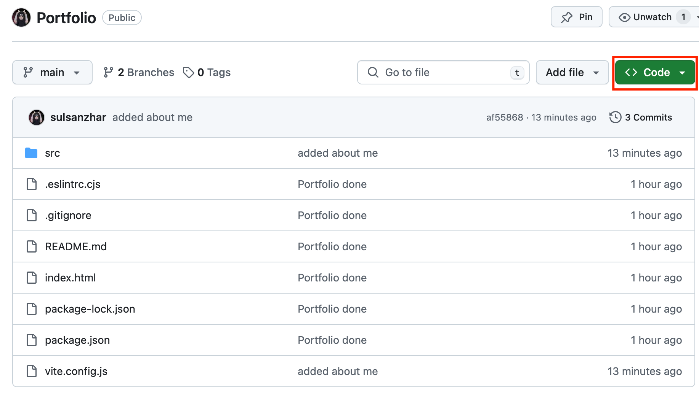
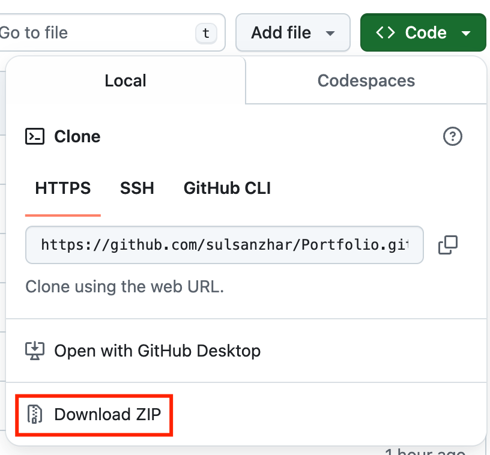
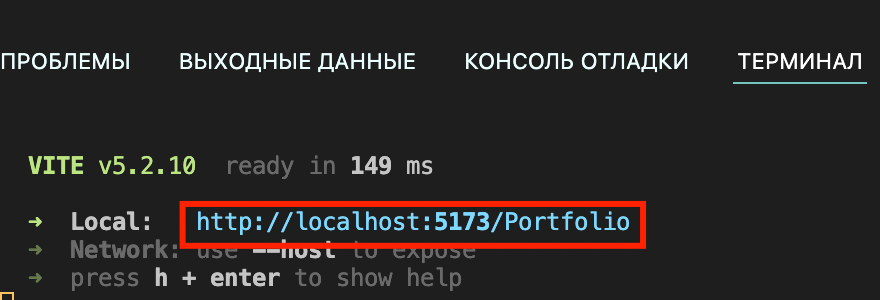

# Click here to see my Portfolio: https://sulsanzhar.github.io/Portfolio/

Hello, below I will attach the steps with which you can run my project with all the required dependencies.




-->  you will need to zip this folder and run it through an IDE (WebStrom, VSCode, etc.) 

--> you need to launch a terminal using the development environment then enter the following command in terminal

```

npm i / npm install

```

--> the last step remains - the command to launch the application

```
npm run dev
```





Just hover over this link and press ctrl + LMB (left mouse button) or CMD + click on the touchpad.